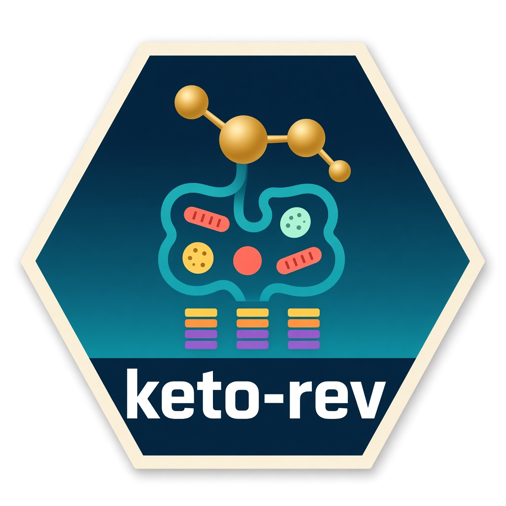
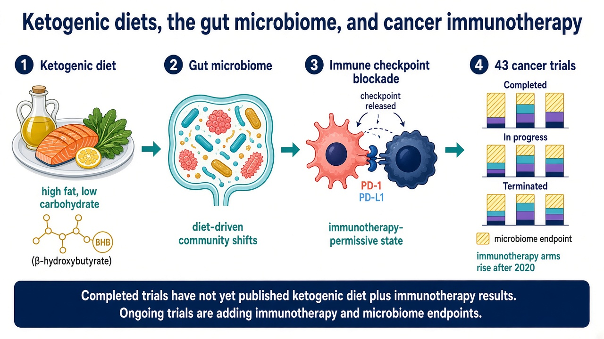

# keto-rev 

[](https://doi.org/10.5281/zenodo.17238355)

Code and curated trial data for a review of ketogenic dietary interventions (KDIs) in cancer clinical trials, with attention to concurrent immunotherapy and gut-microbiome endpoints.

This repository supports:

Bukovac J, Husain M, Sapper T, O'Dell A, Bittoni M, Gastier H, Chebbi A, Hockenhull V, Dohar Z, Moon J, Tabung F, Verschraegen C, Wu R, Kendra K, Yang Y, Volek J, Spakowicz D. How the Ketogenic Diet Shapes the Microbiome to Influence Cancer Immunotherapy Outcomes: An Exploration of Clinical Trials and Their Results. *Nutrition and Cancer*. 2026;78(6):367–396. [doi:10.1080/01635581.2026.2658807](https://doi.org/10.1080/01635581.2026.2658807). PMID: [42077003](https://pubmed.ncbi.nlm.nih.gov/42077003/).

## Graphical abstract



The review covers 43 cancer trials of a ketogenic dietary intervention (20 completed, 13 in progress, 10 terminated or withdrawn). Completed trials have not yet published results that combine a KDI with immunotherapy. Trials started since 2020 increasingly add immunotherapy arms and microbiome endpoints. Hatched bars in Figure 1 mark trials with a microbiome endpoint.

## Citation

Please cite the article when using these scripts or data. The Zenodo record archives this repository.

**Article.** Bukovac J, Husain M, Sapper T, O'Dell A, Bittoni M, Gastier H, Chebbi A, Hockenhull V, Dohar Z, Moon J, Tabung F, Verschraegen C, Wu R, Kendra K, Yang Y, Volek J, Spakowicz D. How the Ketogenic Diet Shapes the Microbiome to Influence Cancer Immunotherapy Outcomes: An Exploration of Clinical Trials and Their Results. *Nutrition and Cancer*. 2026;78(6):367–396. doi:[10.1080/01635581.2026.2658807](https://doi.org/10.1080/01635581.2026.2658807). PMID: [42077003](https://pubmed.ncbi.nlm.nih.gov/42077003/). Published online 4 May 2026 (received 11 October 2025; accepted 7 April 2026).

**Archive.** [doi:10.5281/zenodo.17238355](https://doi.org/10.5281/zenodo.17238355)

```bibtex
@article{bukovac2026ketogenic,
  author  = {Bukovac, Jonah and Husain, Marium and Sapper, Teryn and O'Dell, Angela and Bittoni, Marisa and Gastier, Helena and Chebbi, Ashwini and Hockenhull, Victoria and Dohar, Zachary and Moon, Jennifer and Tabung, Fred and Verschraegen, Claire and Wu, Richard and Kendra, Kari and Yang, Yuanquan and Volek, Jeff and Spakowicz, Daniel},
  title   = {How the Ketogenic Diet Shapes the Microbiome to Influence Cancer Immunotherapy Outcomes: An Exploration of Clinical Trials and Their Results},
  journal = {Nutrition and Cancer},
  year    = {2026},
  volume  = {78},
  number  = {6},
  pages   = {367--396},
  doi     = {10.1080/01635581.2026.2658807},
  pmid    = {42077003}
}
```

## Figure panels

Published **Figure 1** is [`manuscript/figures/figure_one.png`](manuscript/figures/figure_one.png). It is a two-row patchwork of stacked bar charts. Each row is faceted by trial status (Completed, In-progress, Terminated/Withdrawn). Diagonal hatching marks a microbiome endpoint.

| Panel | What it shows | Built by | Object in the script |
| --- | --- | --- | --- |
| **A** (top) | Trial design over initiation period | [`manuscript/scripts/figure_one.Rmd`](manuscript/scripts/figure_one.Rmd) | `final_plot2` |
| **B** (bottom) | Concurrent treatment over initiation period | [`manuscript/scripts/figure_one.Rmd`](manuscript/scripts/figure_one.Rmd) | `final_plot` |

The closing chunk stacks the panels with patchwork (`final_plot2 / final_plot`) and writes `faceted_combined.png` in the working directory (`ggsave`, 12 × 9.5 in, 300 dpi). The manuscript copy of that figure is `manuscript/figures/figure_one.png`. A later chunk in the same file converts a PowerPoint PDF export to PNG with `magick`; it reads `~/faceted_combined_pptx.pdf` and is separate from the ggplot panels.

`figure_one.Rmd` expects three data frames already in the session:

| Object | Workbook in this repository | Used for |
| --- | --- | --- |
| `completedtrialdesign` | [`exploratory/data/tables/#ketorev_completedtrial_cancertype.xlsx`](exploratory/data/tables/#ketorev_completedtrial_cancertype.xlsx) | Completed trials, panel A |
| `treatmentinitiation_data` | [`exploratory/data/tables/#keto-rev_treatmentinitiation_data.xlsx`](exploratory/data/tables/#keto-rev_treatmentinitiation_data.xlsx) | Completed trials, panel B |
| `otw_data` | [`exploratory/data/tables/terminated_ongoing_trials_tabledata.xlsx`](exploratory/data/tables/terminated_ongoing_trials_tabledata.xlsx) | In-progress, terminated, and withdrawn trials, both panels |

### Exploratory scripts

Scripts under `exploratory/scripts/` build the same views before microbiome-endpoint hatching was added. They also expect `completedtrialdesign`, `treatmentinitiation_data`, and `otw_data` in the session, except where a `read_excel()` call is noted.

| Script | Panel it draws | Saved file |
| --- | --- | --- |
| [`studydesigncompleted.Rmd`](exploratory/scripts/studydesigncompleted.Rmd) | Completed trials by design. Loads `completedtrialdesign` with `read_excel("exploratory/data/#ketorev_completedtrial_cancertype.xlsx")`. | `trialdesign_figure.png` |
| [`treatmentinitiation.Rmd`](exploratory/scripts/treatmentinitiation.Rmd) | Completed trials by concurrent treatment. Loads `treatmentinitiation_data` with `read_excel("exploratory/data/#keto-rev_treatmentinitiation_data.xlsx")`. | `treatmentinitiation_figure.png` |
| [`faceted_design.Rmd`](exploratory/scripts/faceted_design.Rmd) | Design, faceted by status (`final_plot`). | `combined_trials_by_year_and_design.png` |
| [`facted_treatment.Rmd`](exploratory/scripts/facted_treatment.Rmd) | Concurrent treatment, faceted by status (`final_plot2`). | `combined_trials_by_year_and_treatment.png` |
| [`faceted_combined.Rmd`](exploratory/scripts/faceted_combined.Rmd) | Both rows. The saved figure [`exploratory/figures/faceted_combined.png`](exploratory/figures/faceted_combined.png) has treatment on top and design on the bottom. The last chunk currently stacks `final_plot` (design) over `final_plot2` (treatment) and writes `faceted_combined.png` (12 × 12 in, 300 dpi). | `faceted_combined.png` |
| [`condensed_combined_script.Rmd`](exploratory/scripts/condensed_combined_script.Rmd) | Short form of both rows, in manuscript order: `final_plot2` (design) over `final_plot` (treatment, viridis mako). | `faceted_combined.png` |

Those `ggsave()` calls write into the working directory. The two `read_excel()` paths above omit the `tables/` folder; the workbooks in this repository live in `exploratory/data/tables/`.

Manuscript summary tables (Tables 1–5) are stored as PDFs in [`manuscript/data/tables/`](manuscript/data/tables/) and are not produced by these scripts.
